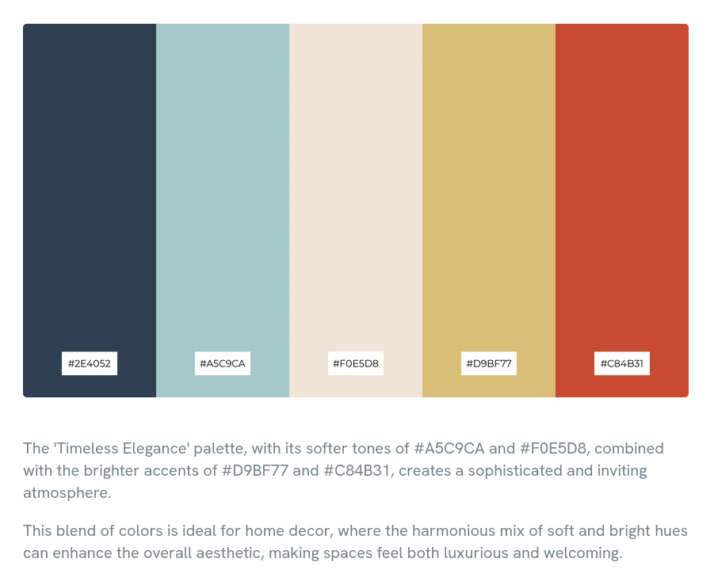

# Mon Portfolio

rgba(61, 242, 224, 0.35)
3DF2E0
3df2e0

# Theme

#2E4052
#A5C9CA
#F0E5D8
#D9BF77
#C84B31

#1D3557

#F1F1F1
#6b967e
#4A6958
#435146
#1B2922
#1C1C1C

| Couleur | Code Hex | Rôle suggéré | Pourquoi ? |
| --- | --- | --- | --- |
| Gris Perle | #F1F1F1 | Fond principal (CV) ou Textes sur fond sombre. | Apporte la clarté nécessaire pour la lecture. |
| Vert Sauge | #6B967E | Boutons, Liens, Titres. | C'est ta couleur "vivante". Elle attire l'œil sans agresser. |
| Vert Forêt | #4A6958 | Sous-titres, Éléments de design. | Parfait pour les icônes ou les bordures de sections. |
| Ardoise Foncé | #435146 | Cartes (Cards) ou Footers. | Moins dur que le noir pour délimiter des zones. |
| Nuit Verte | #1B2922 | Navigation ou Fond "Dark Mode". | Très élégant pour un header ou une section d'accueil. |
| Anthracite | #1C1C1C | Texte principal sur fond clair. | Plus doux pour les yeux qu'un noir pur (#000000). |